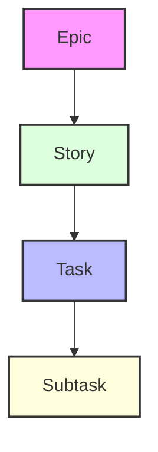

# Cursor Agile Workflow Documentation

This document provides comprehensive documentation for the Agile workflow system integrated with Cursor's AI capabilities. The workflow is designed to maintain project focus and ensure consistent progress through a structured approach to development.

## Overview

The Agile-Cursor workflow combines traditional Agile methodologies with AI-assisted development to create a powerful, efficient development process. It can be utilized in two primary ways:

1. **Rule-Based Implementation** (Automatic)

   - Uses `.cursor/rules/` templates
   - Automatically applies standards to matching files
   - Provides consistent structure enforcement

2. **Notepad-Based Implementation** (Flexible)
   - Uses `xnotes/` templates
   - Lighter weight and more adaptable
   - Ideal for focused development sessions

## Work Item Hierarchy



1. **Epics**

   - Large, self-contained features
   - Only one active at a time
   - Example: "Online Matchmaking System"

2. **Stories**

   - Smaller, implementable work units
   - Must belong to an Epic
   - Example: "User Profile Creation"

3. **Tasks**

   - Technical implementation steps
   - Clear completion criteria
   - Example: "Implement Database Schema"

4. **Subtasks**
   - Granular work items
   - Often includes test requirements
   - Example: "Write Unit Tests"

## AI Project Plan and Memory Structure the Workflow will result in

```
.ai/
├── prd.md                 # Product Requirements Document
├── arch.md               # Architecture Decision Record
├── epic-1/              # Current Epic directory
│   ├── story-1.story.md  # Story files for Epic 1
│   ├── story-2.story.md
│   └── story-3.story.md
├── epic-2/              # Future Epic directory
│   └── ...
└── epic-3/              # Future Epic directory
    └── ...
```

## Workflow Phases

### 1. PLAN Phase

- Focus on documentation and planning
- Only modify `.ai/`, docs, readme, and rules
- Required approvals for PRD and Architecture

### 2. ACT Phase

- Implementation of approved in progress story
- Task-by-task execution
- Continuous testing and validation

```mermaid
graph LR
    subgraph PLAN Phase
        A[Project Idea] --> B[PRD Creation]
        B --> C[Architecture Design]
        C --> D[Epic Planning]
        D --> E[Story Definition]
    end

    subgraph ACT Phase
        E --> F[Story Implementation]
        F --> G[Testing & Validation]
        G --> H[Story Completion]
    end

    subgraph Iteration
        H --> |Next Story|E
        H --> |Epic Complete|I[Epic Completion]
        I --> |Next Epic|D
        I --> |Project Complete|J[Release]
    end

    style A fill:#f9f,stroke:#333,stroke-width:2px
    style B fill:#dfd,stroke:#333,stroke-width:2px
    style C fill:#dfd,stroke:#333,stroke-width:2px
    style D fill:#f9f,stroke:#333,stroke-width:2px
    style E fill:#bbf,stroke:#333,stroke-width:2px
    style F fill:#bbf,stroke:#333,stroke-width:2px
    style G fill:#bbf,stroke:#333,stroke-width:2px
    style H fill:#bbf,stroke:#333,stroke-width:2px
    style I fill:#f9f,stroke:#333,stroke-width:2px
    style J fill:#f9f,stroke:#333,stroke-width:2px
```



## Implementation Guidelines

### Story Implementation Process

1. **Initialization**

   - Verify `.ai` directory exists
   - Locate approved architecture and current story
   - Ensure story is properly marked as in-progress

2. **Development Flow**

   - Follow Test-Driven Development (TDD)
   - Update task/subtask status regularly
   - Document all implementation notes
   - Record significant commands used

3. **Completion Requirements**
   - All tests must pass
   - Documentation must be updated
   - User must approve completion

### Critical Rules

> 🚨 **Critical Rules:**
>
> - Never creates first story without PRD and Architecture approval
> - Only one Epic can be in-progress at a time
> - Only one Story can be in-progress at a time
> - Stories must be implemented in PRD-specified order
> - Never implement without story approval from user (marked as in progress on the story file)

## Using the Workflow

### Rule-Based Approach

1. Install the workflow rules:

```bash
./apply-rules.sh /path/to/your/project
```

2. Use the provided templates by copying them into the `.cursor/rules` directory:
   - `901-prd.mdc` for Product Requirements
   - `902-arch.mdc` for Architecture
   - `903-story.mdc` for Stories

### Notepad-Based Approach

1. Enable Notepads in Cursor options
2. Create notepads from templates:

   - `workflow-agile.md` for full workflow
   - `implementation-agile.md` for story implementation

3. Use `@notepad-name` to access workflow context

> 💡 **Tip:** Use the Notepad approach for:
>
> - Initial project setup (notepad named plan-agile)
> - Story implementation (notepad named impl-story)
> - Focused development sessions
> - Reducing context overhead

- New Context Window Sample Command: `@plan-agile I have an idea for <describe high level here>`
- New Context Window Sample Command: `@impl-story I am ready to start implementing the story current in progress story in complete tasks`

## Best Practices

1. **Documentation**

   - Keep PRD and Architecture documents updated
   - Document all significant decisions
   - Maintain clear implementation notes

2. **Testing**

   - Write tests before implementation
   - Maintain high test coverage
   - Verify all tests pass before completion

3. **Progress Tracking**

   - Update story status regularly
   - Record all implementation notes
   - Document command history

4. **Context Management**
   - Start fresh composer instance per story or after significant recorded progress (recorded in task completion updates)
   - Use appropriate context level
   - Minimize context overhead

## Status Progression

Stories follow a strict status progression:

```
Draft -> In Progress -> Complete
```

Epics follow a similar progression:

```
Future -> Current -> Complete
```

## Integration with Cursor AI

The workflow is designed to work seamlessly with Cursor's AI capabilities:

1. **AI-Assisted Planning**

   - AI helps create and refine PRD
   - AI suggests architecture improvements
   - AI assists in story breakdown

2. **AI-Assisted Implementation**

   - AI implements story tasks
   - AI maintains test coverage
   - AI updates documentation

3. **AI-Assisted Review**
   - AI verifies completion criteria
   - AI suggests improvements
   - AI maintains consistency

## Additional Resources

For more detailed information about specific aspects of the workflow, refer to:

- [Product Requirements Document Template](../.cursor/rules/901-prd.mdc)
- [Architecture Document Template](../.cursor/rules/902-arch.mdc)
- [Story Template](../.cursor/rules/903-story.mdc)
