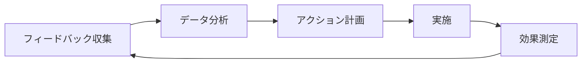

# フィードバックシステム

## 概要
LDDにおけるフィードバックシステムは、継続的な改善と最適化を実現するための重要な要素です。
ユーザーフィードバック、AI分析、システム状態の分析を統合し、効果的な改善サイクルを確立します。

## フィードバックの種類

### 1. ユーザーフィードバック
#### 収集方法
- 直接フィードバック
- アンケート
- 使用状況分析

#### 記録形式
```markdown
# ユーザーフィードバック

## 基本情報
- ID: FB-{YYYYMMDD}-{SEQ}
- 日時: {TIMESTAMP}
- カテゴリ: {CATEGORY}
- 優先度: {PRIORITY}

## フィードバック内容
{詳細な説明}

## 影響範囲
- 影響するコンポーネント
- 影響するユーザー
- 重要度評価

## 対応状況
- [ ] 分析完了
- [ ] 解決策提案
- [ ] 実装完了
- [ ] 検証完了
```

### 2. AI分析フィードバック
#### 分析項目
- コードパターン分析
- パフォーマンス分析
- 品質メトリクス分析

#### 記録形式
```json
{
  "feedback_id": "AI-{YYYYMMDD}-{SEQ}",
  "timestamp": "YYYY-MM-DD HH:mm:ss",
  "category": "ai_analysis",
  "analysis": {
    "pattern_detection": {
      "identified_patterns": [],
      "recommendations": []
    },
    "performance_analysis": {
      "metrics": {},
      "suggestions": []
    },
    "quality_metrics": {
      "scores": {},
      "improvements": []
    }
  }
}
```

### 3. システムフィードバック
#### 監視項目
- リソース使用状況
- エラー発生状況
- パフォーマンス指標

#### 記録形式
```json
{
  "feedback_id": "SYS-{YYYYMMDD}-{SEQ}",
  "timestamp": "YYYY-MM-DD HH:mm:ss",
  "category": "system",
  "metrics": {
    "resource_usage": {},
    "error_rates": {},
    "performance_indicators": {}
  },
  "alerts": [],
  "recommendations": []
}
```

## フィードバック処理

### 1. 収集フェーズ
#### 自動収集
- システムメトリクス
- ログ分析
- パフォーマンスデータ

#### 手動収集
- ユーザーレポート
- チームフィードバック
- 外部評価

### 2. 分析フェーズ
#### データ処理
```python
def analyze_feedback(feedback_data):
    """フィードバックデータの分析
    
    Args:
        feedback_data: 収集されたフィードバックデータ
        
    Returns:
        分析結果と推奨アクション
    """
    analysis = {
        'patterns': detect_patterns(feedback_data),
        'metrics': calculate_metrics(feedback_data),
        'recommendations': generate_recommendations(feedback_data)
    }
    return analysis
```

#### 優先度評価
- 影響度の評価
- 緊急度の判定
- リソース要件の分析

### 3. アクションフェーズ
#### アクション計画
1. 問題の特定
2. 解決策の提案
3. リソースの割り当て
4. 実施スケジュール

#### 実施追跡
- 進捗モニタリング
- 効果測定
- 結果の記録

## フィードバックループ

### 1. 収集→分析→実行


### 2. 継続的改善
- PDCA サイクル
- カイゼン活動
- アジャイル改善

## 統合と自動化

### 1. ツール統合
#### バージョン管理
- コミットメッセージ分析
- 変更履歴追跡
- ブランチ管理

#### CI/CD
- ビルド結果分析
- テスト結果フィードバック
- デプロイ状況モニタリング

### 2. 通知システム
#### アラート設定
```json
{
  "alert_rules": {
    "high_priority": {
      "channels": ["email", "slack"],
      "threshold": "immediate"
    },
    "medium_priority": {
      "channels": ["slack"],
      "threshold": "daily"
    },
    "low_priority": {
      "channels": ["dashboard"],
      "threshold": "weekly"
    }
  }
}
```

#### レポート生成
- 日次サマリー
- 週次レポート
- 月次分析レポート

## ベストプラクティス

### 1. フィードバック収集
- 定期的な収集
- 多角的な視点
- 構造化された形式

### 2. 分析と評価
- 客観的な評価
- データに基づく判断
- 優先順位付け

### 3. アクション実施
- 迅速な対応
- 効果の測定
- 結果の共有

## トラブルシューティング

### 1. 一般的な問題
- フィードバック欠落
- 分析の遅延
- 実施の遅れ

### 2. 解決手順
1. 問題の特定
2. 原因分析
3. 解決策の実施
4. 効果確認

## 参考資料
- [メトリクス管理](metrics.md)
- [ログ管理](logging.md)
- [LDDワークフロー](workflow.md) 